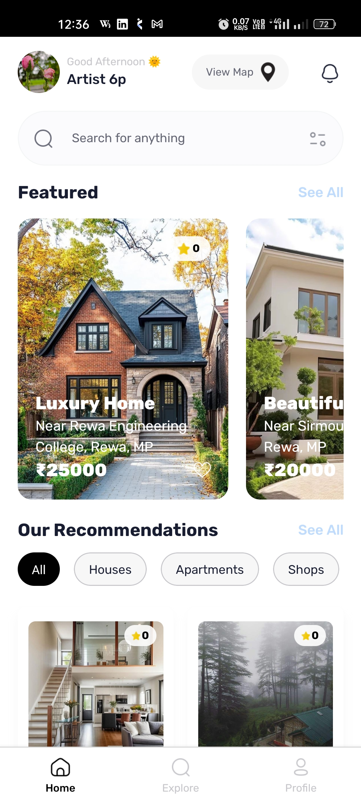
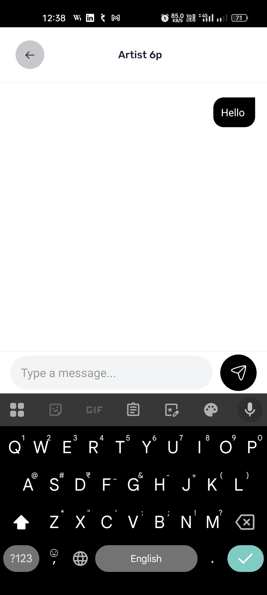
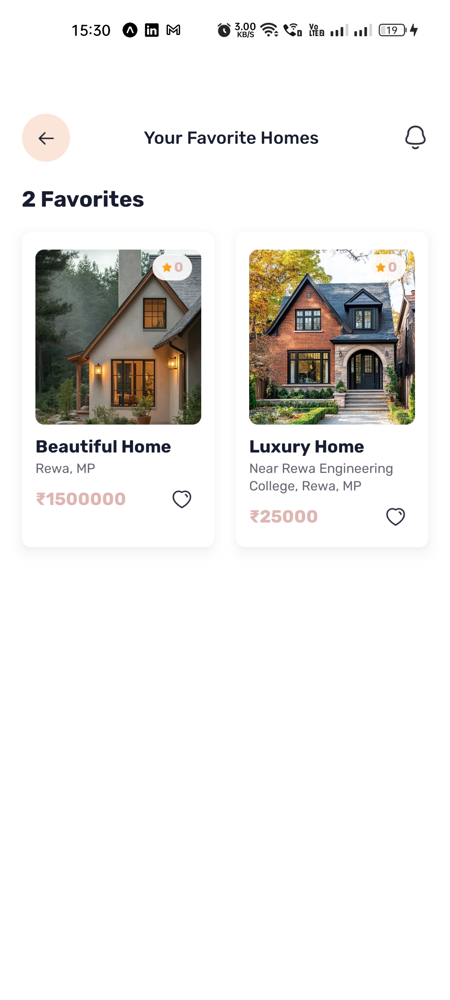
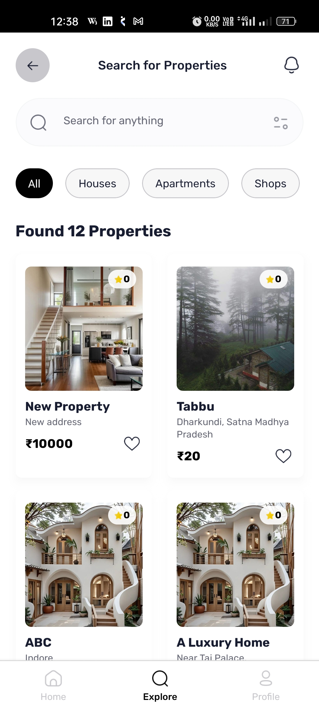
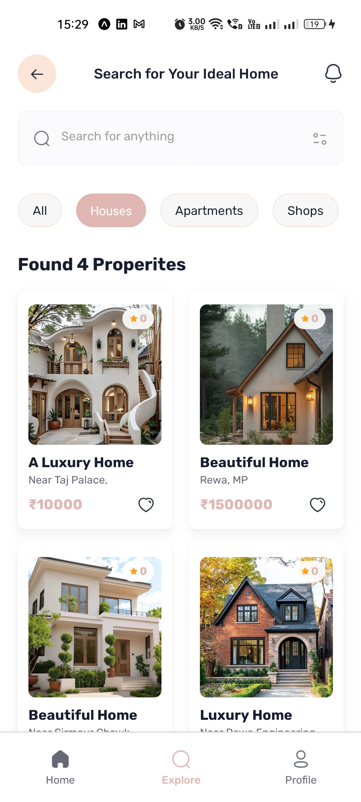
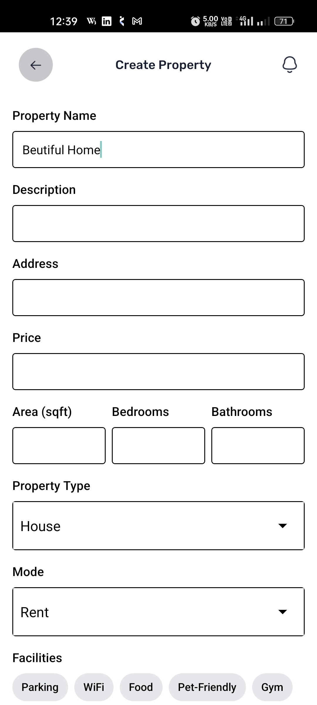
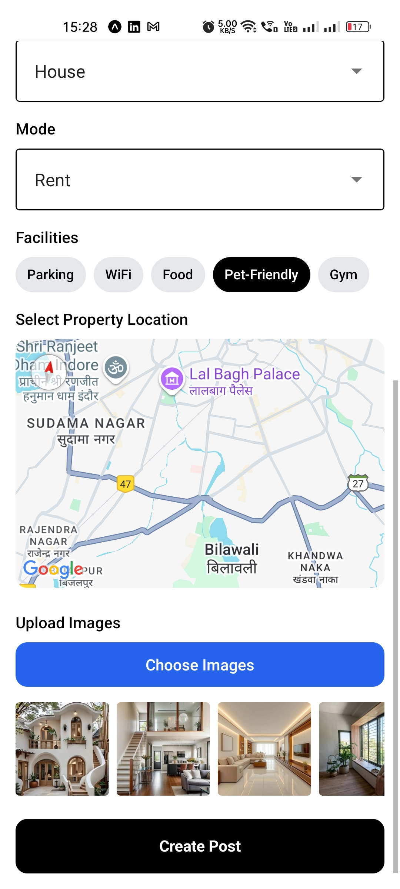
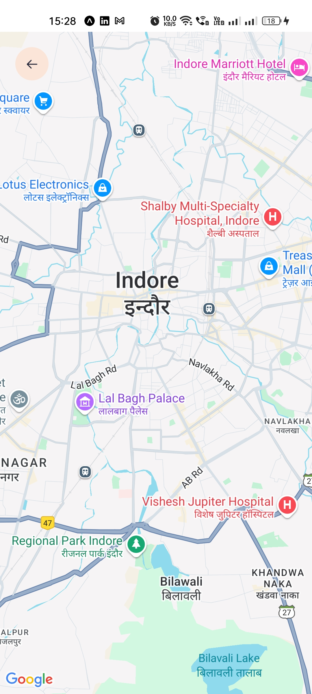
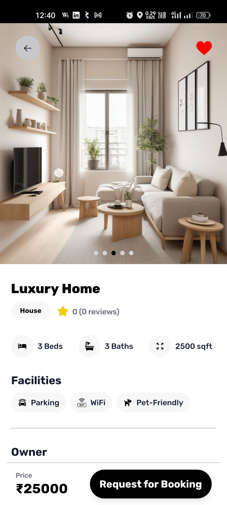
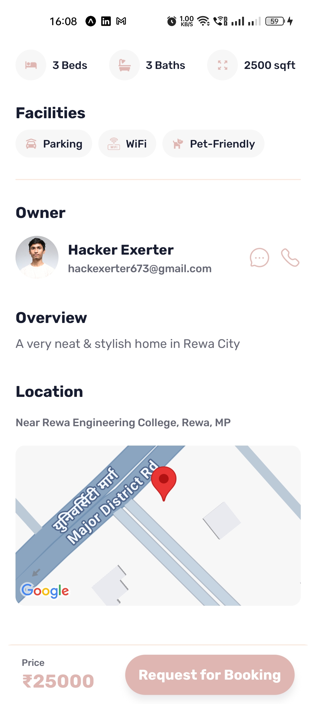

# 🏠 EstateIn - Real Estate Mobile App

A full-featured Real Estate mobile application built with **React Native**, **TypeScript**, and **Appwrite**.

Users can explore properties, view detailed listings, save favorites, chat with owners, and post their own properties — all with Google authentication and real-time features.
You can downloaded the app from this EAS link:
https://expo.dev/accounts/vikash_4ever/projects/EstateIn/builds/9b554cc4-ff89-474a-9e60-ba199367e0c7
---

## 🔧 Tech Stack

- ⚛️ React Native (Expo SDK 53)
- 💅 TypeScript + NativeWind (Tailwind CSS)
- ☁️ Appwrite (Auth, Database, Storage)
- 📍 Geolocation & Maps
- 🔐 Google OAuth
- 💬 Real-time Chat

---

## ✨ Features

- 🔍 Universal Search across users and properties
- 🏘️ Post and manage property listings
- ❤️ Favorite properties
- 📬 Real-time chat between users
- 📌 Mini interactive maps
- 🔒 Google login (OAuth2)0

---

## 📷 Screenshots

### 🏠 Home Screen


### 💬 Chat Screen


### ❤️ Favourites Screen


### 🔍 Explore Screens



### ➕ Create Property Screens



### 🏘️ My Properties Screen


### 📍 Map Screen


### 🏠 Property Detail Screens



### 👤 Profile Screen


### 💬 Message List Screen


### 🚀 Splash Screen


---

## 🚀 Getting Started

```bash
git clone https://github.com/vikash-4ever/EstateInApp.git
cd EstateInApp
npm install
npx expo start

